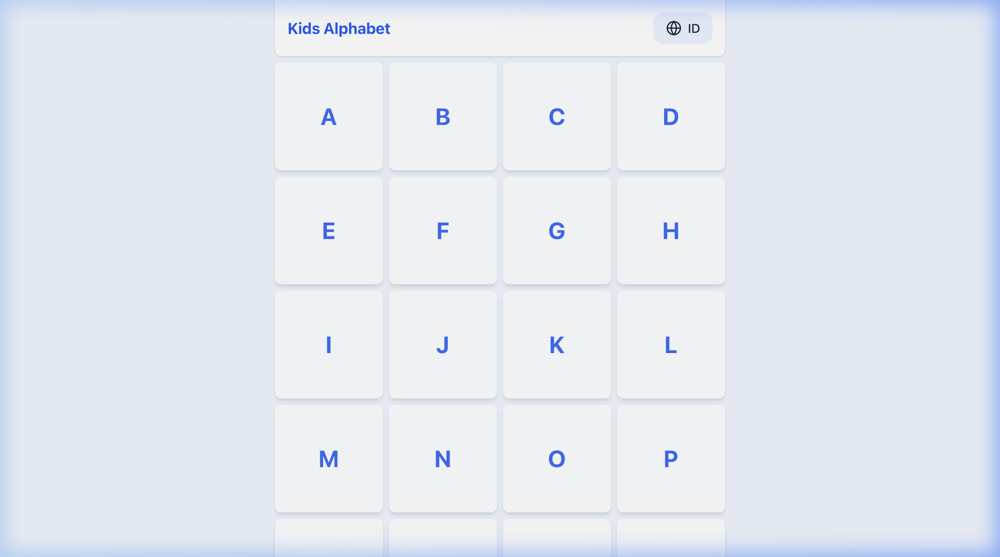
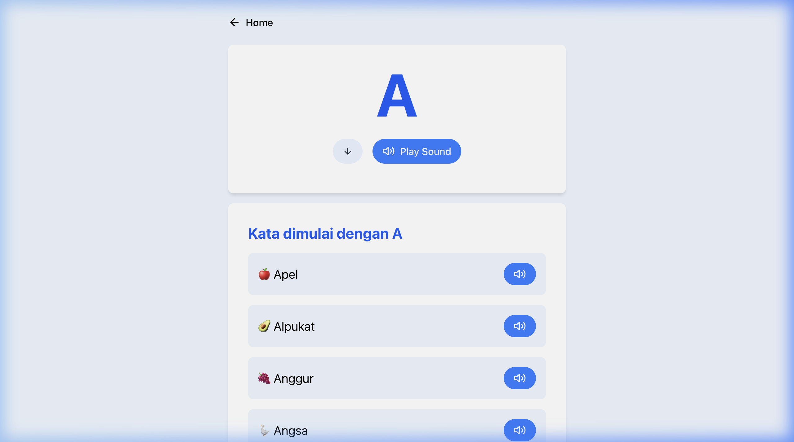
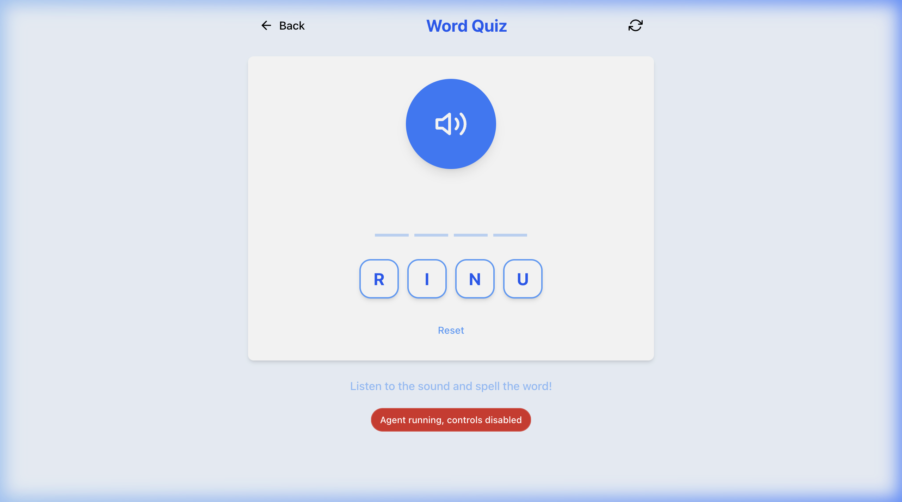

# 🍎 Kids Alphabet Learning

[](https://opensource.org/licenses/MIT)
[](https://kit.svelte.dev/)
[](https://tailwindcss.com/)
[](https://pages.cloudflare.com/)

An interactive and colorful alphabet learning application designed for children. Supports both **English** and **Bahasa Indonesia**, providing a fun way to explore letters, words, and emojis.

## ✨ Features

- 🌍 **Bilingual Support**: Toggle between English and Bahasa Indonesia seamlessly.
- 📚 **Rich Vocabulary**: Multiple example words for every letter from A to Z.
- 🎨 **Visual Learning**: Each word is paired with a relevant emoji for better retention.
- 🧠 **Interactive Quiz**: Challenge your knowledge with a fun word-to-emoji matching quiz.
- 📱 **Responsive Design**: Works perfectly on tablets, phones, and desktops.
- ⚡ **Fast & Modern**: Built with SvelteKit and Tailwind CSS for a smooth experience.

## 📸 Screenshots

| Home Page | Letter Details | Word Quiz |
| :---: | :---: | :---: |
|  |  |  |

## 🛠️ Tech Stack

- **Framework**: [SvelteKit](https://kit.svelte.dev/)
- **Styling**: [Tailwind CSS](https://tailwindcss.com/)
- **Icons**: [Svelte Feather Icons](https://github.com/0x80/svelte-feather-icons)
- **Deployment**: [Cloudflare Pages](https://pages.cloudflare.com/)
- **Package Manager**: [pnpm](https://pnpm.io/)

## 🚀 Getting Started

### Prerequisites

- [Node.js](https://nodejs.org/) (v18 or later)
- [pnpm](https://pnpm.io/installation)

### Installation

1. Clone the repository:
   ```bash
   git clone https://github.com/your-username/alphabet-for-kids.git
   cd alphabet-for-kids
   ```

2. Install dependencies:
   ```bash
   pnpm install
   ```

### Development

Start the development server:
```bash
pnpm dev
```

### Build

Build the project for production:
```bash
pnpm build
```

Preview the production build:
```bash
pnpm preview
```

### Deployment

This project is currently configured for [Cloudflare Pages](https://pages.cloudflare.com/) using `@sveltejs/adapter-cloudflare`.

If you want to deploy to a different platform (like Vercel, Netlify, or a VPS), you will need to switch the SvelteKit adapter. Refer to the **[Official SvelteKit Adapters Documentation](https://svelte.dev/docs/kit/adapters)** for a list of available adapters and detailed setup instructions.

## 🤝 Contributing

Contributions are welcome! If you have ideas for new features, more example words, or improvements to the design, feel free to:

1. Fork the project.
2. Create your feature branch (`git checkout -b feature/AmazingFeature`).
3. Commit your changes (`git commit -m 'Add some AmazingFeature'`).
4. Push to the branch (`git push origin feature/AmazingFeature`).
5. Open a Pull Request.

## 📄 License

This project is licensed under the MIT License - see the [LICENSE](LICENSE) file for details.
